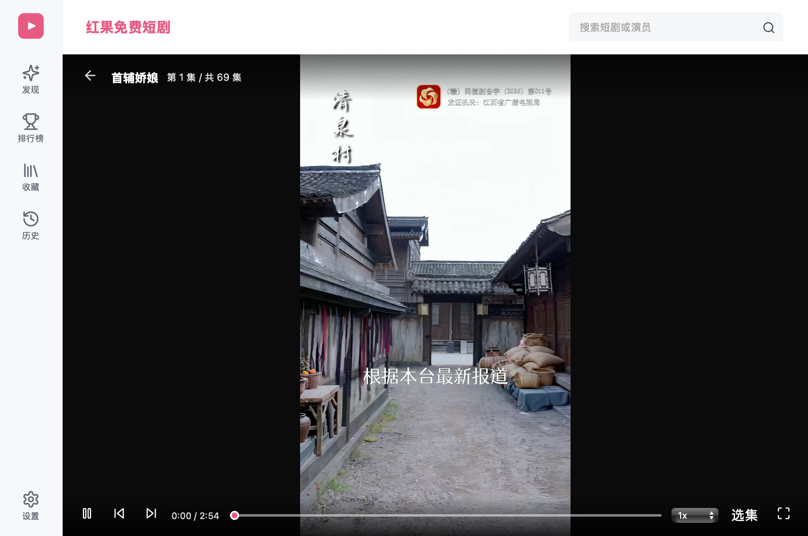

# 红果短剧 Mac 版｜macOS 桌面播放器（非官方）

**红果短剧电脑版的 macOS 第三方适配版** · macOS 13+ · Apple Silicon 已实测

[发行页（安装包待公开）](https://github.com/StriveToLearnCode/hongguo-short-drama-macos/releases) · [安装说明](#安装) · [反馈问题](https://github.com/StriveToLearnCode/hongguo-short-drama-macos/issues)

这是一个由 `StriveToLearnCode` 独立维护的 macOS 项目，参考 [红果桌面版 Windows 发行仓库](https://github.com/waligoraamodio288-rgb/hongguo-desktop-releases)的公开界面和功能。**本项目不是红果官方软件，也不是原 Windows 作者发布的 Mac 移植版。**原项目私有源码没有公开；两者的内容来源、底层实现和可用性不能视为相同。

**发行状态：**0.1.0 安装包和校验摘要保留为 GitHub 草稿，[修订说明](RELEASE_NOTES.md)。外部内容服务仓库没有明确许可证，公开下载暂待授权范围明确。

**发布判断（2026-10-07）：暂缓公开发行与集中宣传。** Apple Silicon 的核心流程已实测，但 Intel 播放、macOS 13 实机和上游授权尚未通过门槛；[完整测试、竞品对照与宣传计划](RELEASE_REVIEW.md)。

查看详情页与播放器截图

截图为本项目早期 0.1.0 草稿在 macOS 上运行时拍摄，修订草稿的分类与图标会有所不同；封面及视频画面来自内容服务，版权归原权利方，具体片单会变化。

## 功能

- 发现、组合分类筛选、逐页下滑加载、热播榜、新剧榜、搜索与剧集详情
- 选集分组和集数定位、播放进度、1 至 3 倍速、自动连播
- 同系列选季（搜索结果包含相关季时）、只读弹幕、系统画中画或置顶小窗
- 跟随系统、浅色和深色外观；有更高公开版时提示并打开发行页，更新仍需手动安装
- 本机收藏、观看历史、断点续播与历史清理
- `⌘ Shift B` 隐藏并暂停窗口，返回后恢复原状态
- 图形化首次安装、播放服务状态与失败重试

收藏与进度仅保存在这台 Mac，不同步手机红果账号。在线片单与播放依赖用户设备首次启动时获取的外部内容服务，服务或接口变化可能导致搜索、封面或播放暂时不可用。

## 与同类 Mac 项目相比

| 项目 | 公开版本与定位 | 当前判断 |
|---|---|---|
| [JialaoLiu/hongguo-mac-release](https://github.com/JialaoLiu/hongguo-mac-release/releases/tag/v0.4.3) | 已发行 Apple Silicon DMG，README 写明 macOS 26+；提供应用内更新，说明中列有评论、画中画和深浅色 | 发布体验和已说明的功能更完整 |
| [zerozhh/hongguo-mac](https://github.com/zerozhh/hongguo-mac/releases/tag/v1.0.2) | 公开版 v1.0.2 为 ZIP 与安装脚本；另有本地 v1.0.5 arm64 DMG 候选版 | 源码可见；v1.0.5 包内有弹幕和小窗。随后更新的源码加入了更新提示，但尚未进入该 DMG |
| 本项目 | 0.1.0 通用 DMG 仍是草稿；Apple Silicon/macOS 15.3.1 已实测 | macOS 13+ 与 Intel 覆盖是潜在差异，不能在实机验证前宣称领先 |

当前没有证据证明本项目整体超过已发行的 Mac 竞品。上表依据检查日的公开发行页、README 与本机可核对的候选包；竞品功能未逐项独立验收。新增功能属于待公开的修订草稿，不应与已经发行的竞品版本混同。

当前通用包包含 Apple Silicon 和 Intel 两种应用架构；**物理 Intel Mac 的签名服务与播放尚未实机验证**。x86_64 组件在 Apple Silicon 的 Rosetta 环境中遇到原生库崩溃，安装器会在 M 系列 Mac 上改用原生 arm64 组件。

## 安装

安装包公开后可按以下步骤安装：

1. 下载发行页的 `HongguoMac-0.1.0-universal.dmg`，核对同页的 SHA-256 摘要。
2. 打开 DMG，将“红果短剧 Mac 版”拖入“应用程序”。
3. 首次打开时，如 macOS 提示无法验证开发者，请在“系统设置 → 隐私与安全性”中选择“仍要打开”。本版本没有 Apple Developer ID 签名或公证；请核对下载来源，不要关闭系统防护。
4. 应用会以图形界面下载独立 Python、Java 和固定版本的外部内容服务。首次运行需要联网，下载量约 300 MB，网络较慢时可能超过 10 分钟；不需要 Homebrew 或开发者工具。

安装完成后会直接进入发现页。若服务未就绪，界面会显示原因与“重试”“打开安装日志”。

## 常见问题

**首次安装失败？** 检查网络后点“重试”；可点“打开安装日志”查看具体阶段。失败不会删除收藏和观看历史。

**能打开首页但不能播放？** 在“设置 → 播放服务”点“检查连接”；若仍失败，请反馈应用版本、macOS 版本、剧名、集数和错误提示。不要公开令牌或完整私人日志。

**看剧会占用磁盘空间吗？如何清除视频缓存？** 会。已播放的剧集和预加载的下一集会缓存在 `~/Library/Application Support/HongguoMac/backend/downloads/.stream_cache`。先退出应用，再在 Finder 中按 `⌘⇧G`，粘贴该路径，删除文件夹内的文件即可；下次播放会重新下载。应用每次启动时会将这处缓存整理至约 2 GB 以下，目前没有应用内“清除缓存”按钮。只清理视频缓存不会删除收藏和观看记录。

**如何卸载？** 删除“应用程序”中的 App；如需同时删除本机收藏、历史、运行组件和缓存，再删除 `~/Library/Application Support/HongguoMac`。

## 来源与说明

本仓库仅用于公开发行与反馈，不包含应用源码或第三方后端代码。第三方组件在用户设备首次运行时从各自来源获取，具体见 [NOTICE.md](NOTICE.md)。品牌、封面和剧集内容归各自权利方所有。本项目使用描述性名称帮助 Mac 用户找到适配版，不暗示官方授权或与原 Windows 作者合作。
