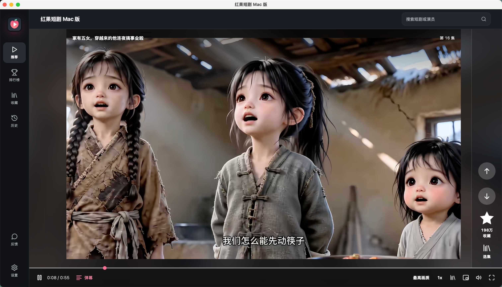
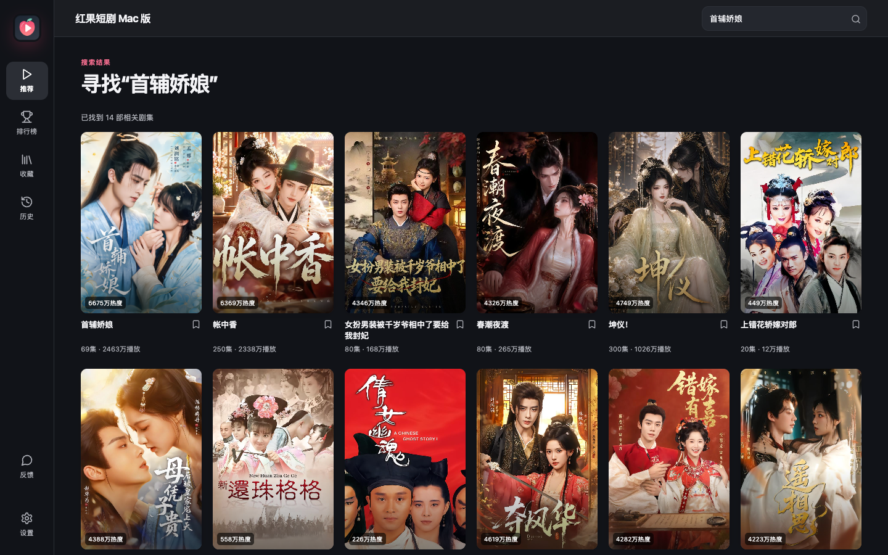

# 红果短剧 Mac 版

**非官方 macOS 桌面播放器 · 打开即看 · 历史续播**

[下载 v0.1.5 完整 DMG](https://github.com/StriveToLearnCode/hongguo-short-drama-macos/releases/download/v0.1.5/HongguoMac-0.1.5-universal.dmg) · [下载页](https://strivetolearncode.github.io/hongguo-short-drama-macos/) · [校验文件](https://github.com/StriveToLearnCode/hongguo-short-drama-macos/releases/download/v0.1.5/SHA256SUMS.txt) · [反馈问题](https://gitee.com/huangxinya0928/hongguo-short-drama-macos/issues)

这是由 `StriveToLearnCode` 独立维护的 Mac 客户端，与红果短剧官方和其他桌面客户端没有隶属关系。此仓库用于发行与反馈，不包含客户端源码；v0.1.5 安装包内置首次运行所需的第三方组件。

**v0.1.5 正式版：**安装、启动和播放失败现在能分阶段归因，本机保留诊断详情；推荐续刷、搜索分页和切集体验继续优化。完整 DMG 内置两种 Mac 架构的运行组件。覆盖安装保留收藏、历史和观看进度。

**v0.1.1 检查更新失败？** 旧版依赖 GitHub API，已安装的检查逻辑无法远程修复。直接从本页下载 v0.1.5 DMG，拖入“应用程序”覆盖安装一次；之后可使用新版的备用检查来源。

## 当前功能

**打开就看**

- 启动进入推荐播放；上下切换剧目，同一部剧播完后自动接下一集。
- 推荐流继续加载后续内容，并尽量避开近 24 小时已展示的剧；本机收藏和有效观看记录可参与轻量重排，没有偏好信号时沿用上游顺序。偏好不上传。
- 搜索剧名或演员，浏览热播、推荐和新剧榜，结果可直接进入播放器。

**连续追剧**

- 选集侧栏显示简介、分集和可识别的关联季；收藏、历史、集数与观看位置保存在本机。
- 播放中切换最高画质、1080p、720p、540p、360p；具体可用画质取决于片源，切换失败会保留原播放。
- 倍速、全屏、置顶小窗与键盘快捷操作；弹幕可随时开关。
- 中断后重试并尝试其他画质；针对部分 HE-AACv2 音轨做兼容处理。
- 下一集预加载默认开启以减少切集等待；低配机器或流量敏感时可在设置中关闭。
- 深色、浅色或跟随系统；应用内反馈入口与新版本提示。

收藏与观看记录不与手机红果账号同步。片单和播放可用性取决于内容来源及网络；本机偏好重排不代表官方账号推荐。

默认发送匿名启动、播放成功和预设失败类别统计，通过随机安装 ID 去重，服务端只保存散列值；不上传观看内容、设备信息或错误详情，可在“设置 → 匿名使用统计”中关闭。关闭后本机诊断日志仍可供用户自行查看，不自动上传。

## 安装

**Apple Silicon / macOS 15.3.1 曾验证此前版本离线安装与播放；v0.1.5 已通过离线安装回归。**安装包包含 arm64 与 x86_64 应用及运行组件；本版全新账户实际播放、M5/macOS 26、物理 Intel Mac 和 macOS 13 仍待实机验证。

1. 下载 [`HongguoMac-0.1.5-universal.dmg`](https://github.com/StriveToLearnCode/hongguo-short-drama-macos/releases/download/v0.1.5/HongguoMac-0.1.5-universal.dmg)，与同页的 [`SHA256SUMS.txt`](https://github.com/StriveToLearnCode/hongguo-short-drama-macos/releases/download/v0.1.5/SHA256SUMS.txt) 对照。
2. 打开 DMG，将“红果短剧 Mac 版”拖入“应用程序”。
3. 从“应用程序”启动。本版采用临时签名，尚未经过 Apple 公证。如果系统**仅提示无法验证开发者**，可在“系统设置 → 隐私与安全性”中针对本应用确认打开。若提示恶意软件或“将损坏你的电脑”，停止安装并[反馈](https://github.com/StriveToLearnCode/hongguo-short-drama-macos/issues)；不要关闭系统防护。
4. 首次启动会从安装包在本机配置 Python、Java 和内容服务，完成后自动进入推荐页；安装运行环境不需要联网，搜索和播放仍需联网。

应用会检查正式发行版；更新仍需手动下载 DMG 并覆盖安装。

## 常见问题

**首次安装失败？** 在安装界面重试，或打开安装日志查看失败阶段。若提示内置运行组件校验失败，请重新下载 DMG 并核对 SHA-256。

**播放中断？** 在播放器中重试、切换画质，或到“设置 → 播放服务”检查连接。反馈时请提供版本、macOS 版本、剧名、集数、操作步骤和错误文字；不要公开账号凭据或完整私人日志。

**提示“所有签名服务失败”？** v0.1.2 起已修复代理误转发 `127.0.0.1` 的问题；若仍报错，请反馈完整错误文字及代理软件名称。

**如何清理缓存？** 先退出应用，再检查 `~/Library/Application Support/HongguoMac/backend/downloads/.stream_cache`。只删除此目录的视频缓存不会删除收藏和历史；下次播放会重新下载。应用启动时会整理旧缓存。

**如何卸载？** 删除“应用程序”中的客户端。如需清除本机记录、匿名统计设置和运行组件，再删除 `~/Library/Application Support/HongguoMac`。

## 来源

第三方组件与来源见 [NOTICE.md](NOTICE.md)。红果品牌、封面和视频内容归各自权利方所有。客户端源码目前未公开，本站不暗示官方授权或 Apple 公证代表内容授权。
